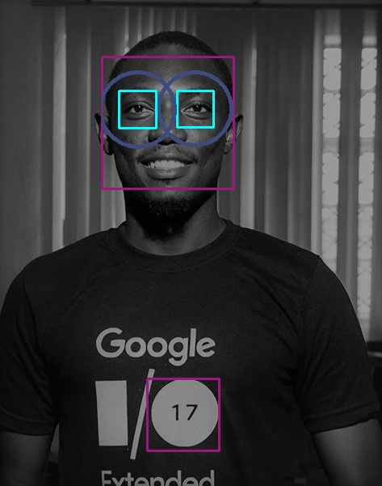

## Learning OpenCV
> [OpenCV](https://opencv.org) is an opensource computer vision library written in C++ with an amazing [Python](https://python.org) library.

* Face detection using OpenCV

In a plight to build a facial recognition systems the ability to recognise faces is important to narrow down the location os available faces, using frontal-face and eye haarcascades you can achieve the following image
[Find Code Here](detectFaceEye.py)

